# Money Canonicalization — Full Runtime Object Interaction

This diagram shows the COMPLETE runtime object interaction inside `src/paxman/`
when a caller invokes `paxman.canonicalize(input, Money(...))` and the
`MoneyCapability` claims the contract. Every object, branch, and edge below is
taken from the actual source:

- Entry / orchestration: `src/paxman/_core/engine.py` (`canonicalize`)
- Registry / resolver: `src/paxman/_registry/capability_registry.py`
- Contract DSL: `src/paxman/_dsl/parser.py` (`parse_contract`)
- Engine / editions: `src/paxman/_core/engine_env.py` (`Engine`, `Authority`)
- Capability: `src/paxman/_capabilities/money/canonicalizer.py`
- Recognition + parsing: `src/paxman/_capabilities/money/grammar.py`
- Rule manifest + evidence: `src/paxman/_capabilities/money/rules.py`
- Validation / classification: `src/paxman/_core/validation.py`, `src/paxman/_core/classification.py`
- Artifact: `src/paxman/_core/artifact.py` (`ExecutionArtifact`, `VersionStamp`)
- Replay: `src/paxman/_core/replay.py`

Every `alt` block below lists ALL branches the source can take (no single-state
`alt` without its complement).

```mermaid
sequenceDiagram
    autonumber
    actor Caller
    participant API as paxman.canonicalize (engine.py)
    participant ORT as default_registry (orchestrator_runtime)
    participant REG as CapabilityRegistry (capability_registry.py)
    participant DISCOVERY as builtin_capabilities (discovery.py)
    participant DSL as parse_contract (dsl/parser.py)
    participant STUB as _StubContract (engine.py)
    participant ENG as Engine (engine_env.py)
    participant AUTH as Authority (provenance/authority.py)
    participant CAP as MoneyCapability (money/canonicalizer.py)
    participant GR as recognize_money (money/grammar.py)
    participant PA as parse_amount (money/grammar.py)
    participant RULES as money/rules.py _evidence + _RULE_AUTHORITIES
    participant VAL as validate_value (core/validation.py)
    participant VRES as ValidationResult (core/classification.py)
    participant CLS as classify (core/classification.py)
    participant ART as ExecutionArtifact + VersionStamp (core/artifact.py)
    participant REPLAY as replay (core/replay.py)

    Caller->>API: canonicalize(input, Money(currency=...))

    Note over API,REG: Stage 0 - lazy builtin load + freeze (once per process)
    API->>ORT: read default_registry
    API->>REG: is_frozen ?
    alt registry not yet frozen
        API->>DISCOVERY: builtin_capabilities()
        DISCOVERY-->>API: list of 10 Capability objects
        API->>REG: load_builtins(list)
        REG->>REG: for each cap skip if name taken else register
        API->>REG: freeze()
        REG->>REG: _frozen = True (immutable capability set)
    else registry already frozen
        REG-->>API: skip load_builtins and freeze (no-op)
        Note over REG: capability set already fixed from first canonicalize
        Note over REG: any later register_capability raises FrozenRegistryError
    end

    alt engine argument is None
        API->>ENG: Engine.default()
        ENG->>ENG: bind every authority to its latest edition
        ENG-->>API: Engine with concrete Authority editions
    else engine argument provided
        API->>API: use the caller supplied Engine unchanged
    end

    Note over API,DSL: Stage 1 - inspect (parse contract DSL)
    API->>DSL: parse_contract(Money(...))
    alt parse_contract raises ContractError
        DSL-->>API: raise ContractError
        API->>STUB: _StubContract(contract)
        API->>ART: _build_artifact UNSUPPORTED unparseable_contract authority None
        ART-->>Caller: ExecutionArtifact status UNSUPPORTED
    else parsed successfully
        DSL-->>API: CanonicalMoneyContract (parsed_contract)

        Note over API,ENG: Stage 1.5 - per-contract authority override
        API->>API: override = parsed_contract.authority_override
        alt override is not empty
            loop for each name, selector in override
                API->>ENG: engine.override(name, selector)
                ENG->>ENG: resolve selector to concrete Authority edition
                ENG-->>API: new Engine with name re-bound
            end
        else override is empty
            API->>API: keep engine as is (no re-bind)
        end

        Note over API,REG: Stage 2 - resolve claimants
        API->>REG: resolve_all(parsed_contract, input)
        REG->>REG: for each cap in _capabilities.values()
        REG->>CAP: cap.can_handle(contract, value)
        CAP-->>REG: True if CanonicalMoneyContract and value None or str
        REG->>REG: collect claimants then sort by cap.name
        REG-->>API: list of claimant Capabilities sorted by name

        alt no claimants (empty list)
            API->>ART: _build_artifact UNSUPPORTED no_capability_claims
            ART-->>Caller: ExecutionArtifact status UNSUPPORTED
        else more than one claimant
            API->>ART: _build_artifact AMBIGUOUS multiple_claimants
            ART-->>Caller: ExecutionArtifact status AMBIGUOUS
        else exactly one claimant
            REG-->>API: [MoneyCapability]
            API->>CAP: canonicalize(input, parsed_contract, engine)

            Note over CAP,RULES: Stage 3+4 - execute + canonicalize (sequential guards)

            alt contract is not a CanonicalMoneyContract
                CAP-->>RULES: _evidence("not_a_money_contract", engine)
                RULES-->>CAP: Evidence(rule, authority=None)
                CAP-->>API: CapabilityResult(status=INVALID)
            else contract is a CanonicalMoneyContract
                alt value is not None and not a str
                    CAP-->>RULES: _evidence("not_a_string_value", engine)
                    RULES-->>CAP: Evidence(authority=None)
                    CAP-->>API: CapabilityResult(status=INVALID)
                else value is None or a str
                    alt value is None or whitespace only
                        CAP-->>RULES: _evidence("missing_value", engine)
                        RULES->>ENG: engine.authority(name) resolves concrete Authority edition
                        RULES-->>CAP: Evidence(rule, authority=real Authority)
                        CAP-->>API: CapabilityResult(status=INVALID)
                    else value is a non-empty str
                        alt contract.strip_spaces is True and value changed after strip
                            CAP->>CAP: value = value.strip()
                            CAP-->>RULES: _evidence("trimmed_whitespace", engine)
                            RULES-->>CAP: Evidence(authority=None)
                        else no whitespace trimming applied
                            CAP->>CAP: value unchanged (no trimmed_whitespace evidence)
                        end

                        CAP->>GR: recognize_money(value, contract)
                        GR->>GR: _strip_amount_text trims empty rejected
                        GR->>GR: _split_sign outer sign trailing minus parens
                        GR->>GR: _detect_symbol validates vs contract.currency
                        GR->>GR: _detect_code validates code detects ":" canonical
                        GR->>GR: _split_sign inner sign rejects contradictory

                        alt recognize_money raises ContractError
                            GR-->>CAP: raise ContractError
                            CAP-->>RULES: _evidence("unrecognized_format", engine)
                            RULES-->>CAP: Evidence(authority=None)
                            CAP-->>API: CapabilityResult(status=INVALID)
                        else recognized
                            GR-->>CAP: MoneyParts(currency, amount, symbol, code, sign, canonical)

                            CAP->>PA: parse_amount(amount, contract.currency, parts.canonical)
                            PA->>PA: choose separator convention from currency
                            PA->>PA: _validate_thousands rejects ambiguous grouping
                            PA->>PA: Decimal exact preserves literal decimals normalizes sci notation

                            alt parse_amount raises ContractError
                                PA-->>CAP: raise ContractError
                                CAP-->>RULES: _evidence("unrecognized_format", engine)
                                RULES-->>CAP: Evidence(authority=None)
                                CAP-->>API: CapabilityResult(status=INVALID)
                            else parsed
                                PA-->>CAP: canonical decimal string
                                CAP->>CAP: compose canonical = currency + ":" + sign + parsed
                                CAP->>RULES: _evidence("currency_from_contract", engine)
                                RULES->>ENG: resolve Authority edition for this rule
                                RULES-->>CAP: Evidence(rule, authority=real Authority)
                                CAP->>RULES: _evidence("symbol_validated" / "code_validated", engine)
                                RULES->>ENG: resolve Authority edition for this rule
                                RULES-->>CAP: Evidence(rule, authority=real Authority)
                                CAP->>RULES: _evidence("preserved_sign" / "parsed_decimal" / "preserved_decimals" / "canonical_form", engine)
                                RULES->>ENG: resolve Authority edition for this rule
                                RULES-->>CAP: Evidence(rule, authority=real Authority)
                                CAP-->>API: CapabilityResult(status=CANONICALIZED, value=canonical, evidence)
                            end
                        end
                    end
                end
            end

            Note over API,ART: Stage 5 - validate then Stage 6 - classify
            alt capability_result.status is CANONICALIZED
                API->>VAL: validate_value(canonical, parsed_contract)
                alt validate_value raises UnsupportedContractError
                    VAL-->>API: raise UnsupportedContractError
                    API->>ART: _build_artifact UNSUPPORTED validation_unsupported_contract
                    ART-->>Caller: ExecutionArtifact status UNSUPPORTED
                else validate_value returns normally
                    VAL-->>VRES: ValidationResult(is_valid=True)
                end
            else capability_result.status is not CANONICALIZED
                API->>VRES: ValidationResult(is_valid=True)
            end

            API->>CLS: classify(capability_result, VRES)
            alt classify returns CANONICALIZED
                CLS-->>API: Status CANONICALIZED
            else classify returns AMBIGUOUS
                CLS-->>API: Status AMBIGUOUS (carries candidates)
            else classify returns INVALID
                CLS-->>API: Status INVALID
            else classify returns MISSING
                CLS-->>API: Status MISSING
            else classify returns UNSUPPORTED
                CLS-->>API: Status UNSUPPORTED
            end

            API->>ART: _build_artifact(registry, engine, parsed_contract, status, value, evidence, candidates)
            ART->>ART: for each evidence read ev.authority
            ART->>ART: collect distinct Authority editions cited (Law 12)
            ART->>ART: version_stamp = VersionStamp(paxman_version, contract_version, registry.capabilities_hash(), configuration_version)
            ART->>ART: candidates only when status is AMBIGUOUS else None
            ART-->>Caller: ExecutionArtifact(status, value, evidence, contract, authorities, version_stamp)
        end
    end

    Note over Caller,REPLAY: Replay - verification + rehydration (no re-canonicalize)
    Caller->>REPLAY: replay(artifact, contract)
    REPLAY->>DSL: parse_contract(contract)
    alt parse_contract raises ContractError
        DSL-->>REPLAY: raise ContractError
        REPLAY-->>Caller: raise VersionMismatchError
    else parsed successfully
        REPLAY->>REPLAY: compare version_stamp.paxman_version with current paxman version
        alt paxman version mismatch
            REPLAY-->>Caller: raise VersionMismatchError
        else paxman version matches
            REPLAY->>REPLAY: compare version_stamp.contract_version with parsed.version_field
            alt contract version mismatch
                REPLAY-->>Caller: raise VersionMismatchError
            else contract version matches
                REPLAY->>REG: capabilities_hash()
                REG-->>REPLAY: sha256 of sorted capability names
                REPLAY->>REPLAY: compare version_stamp.capabilities_hash with registry hash
                alt capabilities hash mismatch
                    REPLAY-->>Caller: raise VersionMismatchError
                else capabilities hash matches
                    REPLAY->>REPLAY: compare artifact.replay_hash with sha256(canonical_bytes())
                    alt replay_hash mismatch
                        REPLAY-->>Caller: raise CanonicalizationError
                    else replay_hash matches
                        REPLAY->>ENG: Engine.from_artifact(artifact.authorities)
                        ENG->>ENG: merge recorded editions over default roster
                        ENG-->>REPLAY: reconstructed production Engine
                        REPLAY->>ENG: _verify_recorded_authorities(artifact.authorities)
                        alt a recorded edition is unknown or retired
                            ENG-->>REPLAY: raise UnknownAuthorityEdition (surfaces as replay failure)
                            REPLAY-->>Caller: raise UnknownAuthorityEdition
                        else all recorded editions known
                            REPLAY-->>Caller: return artifact unchanged byte for byte
                        end
                    end
                end
            end
        end
    end
```

## Object reference (every participant and what it really is)

- **paxman.canonicalize (engine.py)**: the single public entry point. Owns the pipeline (stages 0-6), the only place that freezes the registry, and the only place that builds the `ExecutionArtifact`.
- **default_registry / orchestrator_runtime**: module-level `CapabilityRegistry` singleton; frozen on first canonicalize.
- **CapabilityRegistry (capability_registry.py)**: the resolver. `resolve_all` iterates `cap.can_handle(contract, value)` over all registered capabilities, then **sorts claimants by name** so registration order cannot leak into the replay hash (Law 1). `capabilities_hash()` is `sha256` of the sorted capability names — recorded in the `VersionStamp`.
- **builtin_capabilities (discovery.py)**: returns the 10 built-in `Capability` objects (including `MoneyCapability`) loaded once before freeze.
- **parse_contract (dsl/parser.py)**: turns the `Money(...)` value object / dict DSL into a `CanonicalMoneyContract`. Raises `ContractError` on malformed input (mapped to `UNSUPPORTED` via `_StubContract`).
- **_StubContract (engine.py)**: a minimal contract stand-in used only when `parse_contract` fails, so the resulting artifact still carries a serializable contract.
- **Engine (engine_env.py)**: an immutable binding of authority names to concrete `Authority` editions. `Engine.default()` binds every authority to its latest edition; `engine.override()` re-binds one name per the contract's `authority_override`; `Engine.from_artifact()` rebuilds the exact production engine at replay time.
- **Authority (provenance/authority.py)**: a concrete cited source (a spec, dataset, or documented policy). Every non-routing `Evidence` carries one; routing/dispatch guards carry `None`.
- **MoneyCapability (money/canonicalizer.py)**: pure `(value, contract, engine) -> CapabilityResult` transform. Guards are sequential early-returns in this order: contract type -> value type -> missing -> strip -> recognize -> parse -> compose.
- **recognize_money / parse_amount (money/grammar.py)**: Layer 1 recognition (sign/symbol/code validation, never guesses currency) and Layer 2 amount parsing (separator convention by currency, thousands validation, exact `Decimal`, F1/Q1/Q2/Q3 rules). Both raise `ContractError` on failure, caught as `INVALID unrecognized_format`.
- **money/rules.py (_evidence + _RULE_AUTHORITIES)**: wraps the shared `_evidence` helper closing over the capability's rule->authority manifest. `missing_value` and the six canonical-form rules resolve a real `Authority` (via `engine.authority(name)`); `not_a_money_contract`, `not_a_string_value`, `trimmed_whitespace`, `unrecognized_format` are routing guards with `authority=None`.
- **validate_value (core/validation.py)**: validates the canonical string against the contract; may raise `UnsupportedContractError` (defensive -> `UNSUPPORTED`).
- **ValidationResult (core/classification.py)**: the validation outcome object consumed by `classify`.
- **classify (core/classification.py)**: maps the `CapabilityResult` + `ValidationResult` to the final `Status` (CANONICALIZED / AMBIGUOUS / INVALID / MISSING / UNSUPPORTED).
- **ExecutionArtifact + VersionStamp (core/artifact.py)**: the returned artifact. `_build_artifact` collects the distinct `Authority` editions cited in the evidence (Law 12) and stamps `paxman_version`, `contract_version`, `capabilities_hash`, `configuration_version`.
- **replay (core/replay.py)**: re-parses the contract, verifies the `VersionStamp` (paxman + contract version), verifies `capabilities_hash` against the live registry, verifies `replay_hash == sha256(canonical_bytes())`, reconstructs the engine via `Engine.from_artifact`, then returns the artifact **unchanged**. It never re-runs `canonicalize`. Any mismatch raises `VersionMismatchError` (version/hash) or `CanonicalizationError` (replay_hash) or `UnknownAuthorityEdition` (retired edition).

## Notes

- Single claimant contract: the registry resolves exactly one capability (`MoneyCapability`) for a `CanonicalMoneyContract`. Zero claimants -> `UNSUPPORTED`; more than one -> `AMBIGUOUS`; an unparseable contract -> `UNSUPPORTED` via `_StubContract`, before any capability runs.
- Currency is never guessed (Law 3): `Money` requires `currency`; the grammar only validates that any symbol/code present matches the contract currency.
- Determinism / idempotence: `parts.canonical` (set when the input is the capability's own `"ISO4217:amount"` output) makes `parse_amount` skip the currency separator convention, so `canonicalize(canonicalize(x)) == canonicalize(x)`.
- Evidence authority (Law 14): routing/dispatch guards carry `authority=None`; `missing_value` and the six canonical-form rules carry a real `Authority` resolved from the engine's bound editions.
- Replay does NOT re-canonicalize — it verifies and rehydrates. A paxman-version, contract-version, or capabilities-hash mismatch raises `VersionMismatchError`; a replay-hash mismatch raises `CanonicalizationError`; a retired/unknown recorded edition raises `UnknownAuthorityEdition`.
