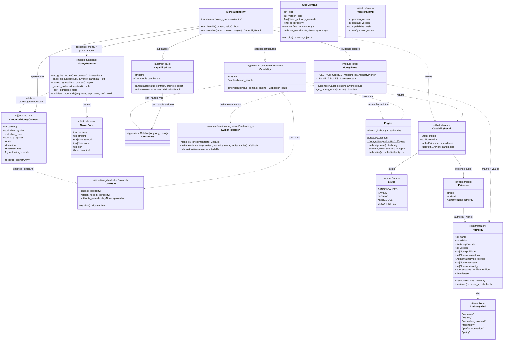

# Money Canonicalization — Class Diagram

Class diagram of every class involved in **Money canonicalization**, extracted
from the actual `src/` code (verified against the on-disk source). The diagram
covers the Money capability package (`src/paxman/_capabilities/money/`), the
shared capability scaffolds (`src/paxman/_capabilities/_shared/`), the core
types it consumes (`src/paxman/_core/`), and the provenance model
(`src/paxman/_provenance/`).

Runtime flow (control surface only; see `MERMAID.md` for the sequence view):

- `MoneyCapability.canonicalize(value, contract, engine)` is the entry point.
- It delegates recognition to `grammar.recognize_money` → returns `MoneyParts`.
- It delegates amount parsing to `grammar.parse_amount` → canonical decimal `str`.
- It emits `Evidence` (each carrying an `Authority`) via the engine-aware
  `_evidence` closure built in `rules.py` (`make_evidence_for`).
- It returns a `CapabilityResult(status, value, evidence, candidates)`.
- `CanonicalMoneyContract` satisfies the `Contract` Protocol structurally and is
  the value object the capability operates on.

## Notes on the evidence

- `MoneyCapability` (canonicalizer.py:24) is the only capability class; it
  subclasses `CapabilityBase` (`_shared/base.py:128`) and structurally satisfies
  the `Capability` Protocol (`protocol.py:26`).
- `CanonicalMoneyContract` (contract.py:247) is an `@attrs.frozen` value object
  that satisfies the `Contract` Protocol (`_core/contracts.py:15`) structurally.
- Recognition produces `MoneyParts` (grammar.py:171), an `@attrs.frozen` value
  object. `recognize_money` and `parse_amount` are module-level functions.
- The Law-14 rule→authority manifest (`_RULE_AUTHORITIES`) and the engine-aware
  `_evidence` closure live in `rules.py`; the closure is produced by
  `make_evidence_for` (`_shared/evidence.py:51`).
- `CapabilityResult` (`result.py:33`) carries `Status` (`status.py:8`) and a
  tuple of `Evidence` (`_provenance/evidence.py:15`), each of which carries an
  `Authority` (`_provenance/authority.py:63`).
- `Engine` (`engine_env.py:77`) is the immutable authority-edition binding the
  capability reads via the engine-aware evidence closure (Concern 3 — replay is
  deterministic against the pinned edition).
- `Money()`, `_build_money()`, `_validate_currency()`, etc. are module-level
  helper functions/validators in `contract.py`, not classes, so they are omitted
  from the class diagram (they back the `CanonicalMoneyContract` value object).
