# Date + Money Canonicalization — Combined Class Diagram

Combined class diagram of **every class involved in both Date and Money
canonicalization**, extracted from the actual `src/` code (verified against the
on-disk source). The goal is to make the shared surface — where the two
capabilities *collide* (reuse the same core/scaffold/provenance types) — and
where they remain *exclusive* (domain-private types) visibly distinct.

Coverage:
- Date capability package (`src/paxman/_capabilities/date/`)
- Money capability package (`src/paxman/_capabilities/money/`)
- Shared capability scaffolds (`src/paxman/_capabilities/_shared/`)
- Core types (`src/paxman/_core/`)
- Provenance model (`src/paxman/_provenance/`)

Legend for the relationship annotations:
- **`[SHARED]`** — both capabilities depend on this type. This is a *collision*
  point: Date and Money are wired through the same core/scaffold/provenance
  machinery. The capability packages never import each other; they meet only
  here.
- **`[DATE-ONLY]`** / **`[MONEY-ONLY]`** — exclusive to one capability's package.
- **`[NONE → see note]`** — the capability does not use the edge; the partner
  does.

```mermaid
classDiagram
    %% =====================================================================
    %% SHARED CORE / SCAFFOLD / PROVENANCE  (both capabilities collide here)
    %% =====================================================================

    class Capability {
        <<@runtime_checkable Protocol>>
        +str name
        +CanHandle can_handle
        +canonicalize(value, contract, engine) CapabilityResult
    }

    class CapabilityBase {
        <<abstract base>>
        +str name
        +CanHandle can_handle
        +canonicalize(value, contract, engine) object
        +validate(value, contract) ValidationResult
    }

    class CanHandle {
        <<type alias: Callable[[Any, Any], bool]>>
    }

    class SharedEvidence {
        <<module functions in _shared/evidence.py>>
        +make_evidence(manifest) Callable
        +make_evidence_for(manifest, authority_name, registry_rules) Callable
        +rule_authorities(mapping) Callable
    }

    class SharedContract {
        <<module functions in _shared/contract.py>>
        +authority_override_field() Any
        +_authority_override_from_spec(spec) Any|None
        +strip_authority_override(payload) dict
        -_AUTHORITY_OVERRIDE_KEY : str
    }

    class Contract {
        <<@runtime_checkable Protocol>>
        +kind: str   «property»
        +version_field: int   «property»
        +authority_override: Any|None   «property»
        +as_dict() dict~str,Any~
    }

    class _StubContract {
        +str _kind
        +int _version_field
        +Any|None _authority_override
        +kind: str   «property»
        +version_field: int   «property»
        +authority_override: Any|None   «property»
        +as_dict() dict~str,object~
    }

    class CapabilityResult {
        <<@attrs.frozen>>
        +Status status
        +str|None value
        +tuple~Evidence,...~ evidence
        +tuple~str,...~|None candidates
    }

    class VersionStamp {
        <<@attrs.frozen>>
        +str paxman_version
        +int contract_version
        +str capabilities_hash
        +str configuration_version
    }

    class Status {
        <<enum.Enum>>
        CANONICALIZED
        INVALID
        MISSING
        AMBIGUOUS
        UNSUPPORTED
    }

    class ValidationResult {
        <<@attrs.frozen>>
        +bool is_valid
    }

    class Classifier {
        <<module function in _core/classification.py>>
        +classify(capability_result, validation) Status
    }

    class Engine {
        -dict~str,Authority~ _authorities
        +default() Engine$
        +from_artifact(authorities) Engine$
        +authority(name) Authority
        +override(name, selector) Engine
        +authorities() tuple~Authority,...~
    }

    class Evidence {
        <<@attrs.frozen>>
        +str rule
        +str detail
        +Authority|None authority
    }

    class Authority {
        <<@attrs.frozen>>
        +str name
        +str edition
        +AuthorityKind kind
        +str version
        +str|None publisher
        +str|None released_on
        +AuthorityLifecycle lifecycle
        +str|None checksum
        +str|None retrieved_at
        +bool supports_multiple_editions
        +Any dataset
        +section(section) Authority
        +retrieved(retrieved_at) Authority
    }

    class AuthorityKind {
        <<Literal type>>
        "grammar"
        "registry"
        "normative_standard"
        "taxonomy"
        "platform-behaviour"
        "policy"
    }

    class AuthorityLifecycle {
        <<Literal type>>
        "active"
        "superseded"
        "retired"
    }

    %% =====================================================================
    %% DATE CAPABILITY PACKAGE  (src/paxman/_capabilities/date/)  [DATE-ONLY]
    %% =====================================================================

    class DateCapability {
        <<@attrs.frozen via CapabilityBase>>
        +str name = "date_canonicalization"
        +CanHandle can_handle
        +canonicalize(value, contract, engine) CapabilityResult
        +validate(value, contract) ValidationResult
    }

    class CanonicalDateContract {
        <<@attrs.frozen>>
        +Literal~"ISO","US","EU"~ locale
        +str language
        +TwoDigitYearPolicy|None two_digit_year
        +str kind
        +int version_field
        +Any authority_override
        +as_dict() dict~str,object~
    }

    class TwoDigitYearPolicy {
        <<type alias: Literal["reject","require_four_digit_year"] | str>>
    }

    class DateGrammar {
        <<@attrs.frozen>>
        +str id
        +str source
        +str pattern
        +re.Pattern~str~ compiled
        +Mapping~str,str~ field_roles
        +str|None shape
    }

    class DateRecognizedRep {
        <<@attrs.frozen>>
        +str grammar_id
        +str source
        +Mapping~str,str~ captures
    }

    class _DateCandidate {
        <<@attrs.frozen (private)>>
        +int|None year
        +int|None yy
        +int month
        +int day
        +bool century_ambiguous
        +str rule
        +str|None ordering
        +int|None weekday
    }

    class _DateSurvivor {
        <<@attrs.frozen (private)>>
        +int year
        +int month
        +int day
        +str rule
        +str|None ordering
        +bool century_ambiguous
    }

    class DateRules {
        <<module-level>>
        -_RULE_AUTHORITIES : Mapping~str, Authority|None~
        -_evidence : Callable (closure, NOT engine-aware)
    }

    class DateGrammarFns {
        <<module functions in grammar.py>>
        +recognize(value, contract) list~DateRecognizedRep~
        +compile_grammar(pattern, language) re.Pattern~str~
        +GRAMMARS : tuple~DateGrammar,...~
    }

    class DateResolverFns {
        <<module functions in canonicalizer.py>>
        +generate_interpretations(value, contract) list~_DateCandidate~
        +resolve_and_validate(candidates, contract) tuple~list~_DateSurvivor~, set~str~~
        +classify(candidates, survivors, drop_reasons) tuple
        +_resolve_pivot_year(yy, policy) int
        +_weekday_of_date(year, month, day) int
    }

    class DateParserFns {
        <<module functions in parser.py>>
        +_is_epoch(value) bool
        +_ISO_DATE_RE : re.Pattern
        +_ISO_DATETIME_RE : re.Pattern
        +_ISO_NAIVE_DATETIME_RE : re.Pattern
        +_NUMERIC_2YEAR_RE : re.Pattern
        +_NUMERIC_4YEAR_RE : re.Pattern
        +_RFC2822_RE : re.Pattern
    }

    class DateValueFns {
        <<module functions in value.py>>
        +_render_date(dt) str
        +_render_datetime(dt) str
    }

    class DateI18n {
        <<module constants in i18n.py>>
        -MONTH_NAMES : Mapping~str, Mapping~str,int~~
        -WEEKDAY_NAMES : Mapping~str, Mapping~str,int~~
        -SUPPORTED_LANGUAGES : frozenset~str~
    }

    class DateCalendarFns {
        <<module function in calendar.py>>
        +_valid_calendar_date(year, month, day) bool
    }

    %% =====================================================================
    %% MONEY CAPABILITY PACKAGE  (src/paxman/_capabilities/money/)  [MONEY-ONLY]
    %% =====================================================================

    class MoneyCapability {
        <<@attrs.frozen via CapabilityBase>>
        +str name = "money_canonicalization"
        +CanHandle can_handle
        +canonicalize(value, contract, engine) CapabilityResult
    }

    class CanonicalMoneyContract {
        <<@attrs.frozen>>
        +str currency
        +bool allow_symbol
        +bool allow_code
        +bool strip_spaces
        +str kind
        +int version
        +int version_field
        +Any authority_override
        +as_dict() dict~str,Any~
    }

    class MoneyParts {
        <<@attrs.frozen>>
        +str currency
        +str amount
        +str|None symbol
        +str|None code
        +str sign
        +bool canonical
    }

    class MoneyGrammarFns {
        <<module functions in money/grammar.py>>
        +recognize_money(raw, contract) MoneyParts
        +parse_amount(amount, currency, canonical) str
        +_detect_symbol(text, contract) tuple
        +_detect_code(text, contract) tuple
        +_split_sign(text) tuple
        +_validate_thousands(segments, sep_name, raw) void
    }

    class MoneyRules {
        <<module-level>>
        -_RULE_AUTHORITIES : Mapping~str, Authority|None~
        -_ISO_4217_RULES : frozenset~str~
        -_evidence : Callable (ENGINE-AWARE closure via make_evidence_for)
        +get_money_rules(contract) list~dict~
    }

    %% =====================================================================
    %% RELATIONSHIPS
    %% =====================================================================

    %% ---- Protocol / base collisions (SHARED) ----
    DateCapability ..|> Capability : [SHARED] satisfies (structural)
    MoneyCapability ..|> Capability : [SHARED] satisfies (structural)
    DateCapability --|> CapabilityBase : [SHARED] subclasses
    MoneyCapability --|> CapabilityBase : [SHARED] subclasses
    CapabilityBase --> CanHandle : [SHARED] can_handle attribute
    Capability ..> CanHandle : [SHARED] can_handle type
    Capability ..> Contract : [SHARED] consumes
    Capability ..> Engine : [SHARED] consumes
    Capability ..> CapabilityResult : [SHARED] returns

    %% ---- Contract Protocol collision (SHARED) ----
    CanonicalDateContract ..|> Contract : [SHARED] satisfies (structural)
    CanonicalMoneyContract ..|> Contract : [SHARED] satisfies (structural)
    SharedContract ..> CanonicalDateContract : [SHARED] authority_override_field / strip
    SharedContract ..> CanonicalMoneyContract : [SHARED] authority_override_field / strip

    %% ---- Result / Status / Evidence collision (SHARED) ----
    DateCapability ..> CapabilityResult : [SHARED] returns
    MoneyCapability ..> CapabilityResult : [SHARED] returns
    CapabilityResult --> Status : [SHARED] status
    CapabilityResult --> Evidence : [SHARED] evidence (tuple)
    CapabilityResult --> ValidationResult : [SHARED] validation path
    Classifier ..> CapabilityResult : [SHARED] reads status
    Classifier ..> ValidationResult : [SHARED] reads is_valid
    Classifier ..> Status : [SHARED] returns
    Evidence --> Authority : [SHARED] authority (|None)
    Authority --> AuthorityKind : [SHARED] kind
    Authority --> AuthorityLifecycle : [SHARED] lifecycle

    %% ---- Evidence builder collision (SHARED) ----
    DateRules ..> SharedEvidence : [SHARED] rule_authorities
    MoneyRules ..> SharedEvidence : [SHARED] make_evidence_for

    %% ---- Engine collision: Money is engine-aware, Date is NOT ----
    MoneyRules ..> Engine : [MONEY-ONLY] re-resolves ISO 4217 edition
    DateRules ..> Engine : [NONE - see note] date rules are grammar/policy, not engine-aware
    MoneyRules ..> Authority : [MONEY-ONLY] manifest cites registry edition
    DateRules ..> Authority : [DATE-ONLY] manifest cites grammar/policy specs

    %% ---- Date-exclusive internal graph ----
    DateCapability --> CanonicalDateContract : [DATE-ONLY] operates on
    CanonicalDateContract --> TwoDigitYearPolicy : [DATE-ONLY] two_digit_year type
    DateCapability --> DateGrammarFns : [DATE-ONLY] recognize
    DateCapability --> DateResolverFns : [DATE-ONLY] generate_interpretations / resolve / classify
    DateCapability --> DateParserFns : [DATE-ONLY] _is_epoch / *_RE
    DateCapability --> DateValueFns : [DATE-ONLY] _render_date / _render_datetime
    DateGrammarFns ..> DateRecognizedRep : [DATE-ONLY] returns (list)
    DateGrammarFns ..> DateGrammar : [DATE-ONLY] builds GRAMMARS tuple
    DateGrammarFns ..> DateI18n : [DATE-ONLY] MONTH_NAMES / WEEKDAY_NAMES
    DateResolverFns ..> _DateCandidate : [DATE-ONLY] enumerates
    DateResolverFns ..> _DateSurvivor : [DATE-ONLY] survivors (validated)
    DateResolverFns ..> DateCalendarFns : [DATE-ONLY] _valid_calendar_date
    DateResolverFns ..> DateI18n : [DATE-ONLY] ordinal resolve
    DateResolverFns ..> CanonicalDateContract : [DATE-ONLY] reads locale / two_digit_year / language

    %% ---- Money-exclusive internal graph ----
    MoneyCapability --> CanonicalMoneyContract : [MONEY-ONLY] operates on
    MoneyCapability --> MoneyGrammarFns : [MONEY-ONLY] recognize_money / parse_amount
    MoneyCapability --> MoneyRules : [MONEY-ONLY] _evidence closure
    MoneyGrammarFns ..> MoneyParts : [MONEY-ONLY] returns
    MoneyGrammarFns ..> CanonicalMoneyContract : [MONEY-ONLY] validates currency/symbol/code
```

## Where Date and Money collide (shared surface)

Both capabilities are wired through the **same** core/scaffold/provenance types
— this is the only place they meet. Neither capability package imports the
other.

1. **`Capability` Protocol** (`protocol.py:26`) — both `DateCapability`
   (`canonicalizer.py:542`) and `MoneyCapability` (`money/canonicalizer.py:24`)
   structurally satisfy it and both subclass `CapabilityBase`
   (`_shared/base.py:128`).
2. **`CanHandle`** (`_shared/base.py:48`) — both set
   `can_handle: CanHandle = make_can_handle(CanonicalDateContract|MoneyContract, ...)`.
3. **`Contract` Protocol** (`_core/contracts.py:15`) — both
   `CanonicalDateContract` (`contract.py:29`) and `CanonicalMoneyContract`
   (`money/contract.py:247`) satisfy it structurally; both back their
   `authority_override` field through `SharedContract`
   (`_shared/contract.py`).
4. **`CapabilityResult`** (`result.py:33`) + **`Status`** (`status.py:8`) +
   **`ValidationResult`/`Classifier`** (`classification.py`) — both return the
   identical result envelope; the orchestrator classifies both identically.
5. **`Evidence`** (`_provenance/evidence.py:15`) + **`Authority`**
   (`_provenance/authority.py:63`) + **`AuthorityKind`/`AuthorityLifecycle`** —
   both cite provenance through the same `Evidence` carrier and the same
   `Authority` value object.
6. **`SharedEvidence`** (`_shared/evidence.py`) — both build their `_evidence`
   closure from it. **This is the one behavioural divergence at the collision
   point:** Money uses `make_evidence_for` (engine-aware — it re-resolves the
   `ISO 4217` registry edition from `Engine`); Date uses `rule_authorities`
   (frozen manifest, grammar/policy-sourced, **not** engine-aware).

## Where they remain exclusive

- **Date-only types**: `CanonicalDateContract`, `TwoDigitYearPolicy`,
  `DateGrammar`/`DateRecognizedRep`, `_DateCandidate`/`_DateSurvivor`,
  `DateGrammarFns`/`DateResolverFns`/`DateParserFns`/`DateValueFns`,
  `DateI18n`, `DateCalendarFns`, `DateRules`. These encode the date grammar
  compiler (bracket notation → regex), the century/locale enumeration model,
  and the Gregorian-calendar validation — none of which Money touches.
- **Money-only types**: `CanonicalMoneyContract`, `MoneyParts`,
  `MoneyGrammarFns`, `MoneyRules`. These encode currency/symbol/code detection,
  decimal amount parsing, and the `ISO 4217` registry rule set — none of which
  Date touches.
- **Engine**: only Money reads it (to pin a registry edition). Date's
  `canonicalize` accepts `engine` but its evidence manifest is grammar/policy
  sourced, so it never calls `engine.authority(...)`.

## Evidence notes (file:line)

- `DateCapability` canonicalizer.py:542; `can_handle` canonicalizer.py:552.
- `CanonicalDateContract` contract.py:29; `TwoDigitYearPolicy` contract.py:25.
- `DateGrammar` grammar.py:33; `DateRecognizedRep` grammar.py:59;
  `GRAMMARS` grammar.py:314; `recognize` grammar.py:381; `compile_grammar`
  grammar.py:240.
- `_DateCandidate` canonicalizer.py:90; `_DateSurvivor` canonicalizer.py:111;
  `generate_interpretations` canonicalizer.py:417; `resolve_and_validate`
  canonicalizer.py:441; `classify` canonicalizer.py:496.
- `DateRules._RULE_AUTHORITIES` rules.py:15 (closure via `rule_authorities`,
  `_shared/evidence.py:37`).
- `MoneyCapability` money/canonicalizer.py:24; `CanonicalMoneyContract`
  money/contract.py:247; `MoneyParts` money/grammar.py:171; `MoneyRules`
  money/rules.py (closure via `make_evidence_for`, `_shared/evidence.py:51`).
- `CapabilityBase` `_shared/base.py:128`; `CanHandle` `_shared/base.py:48`;
  `make_can_handle` `_shared/base.py:56`.
- `Capability` Protocol protocol.py:26; `Contract` Protocol
  `_core/contracts.py:15`; `CapabilityResult` result.py:33; `Status` status.py:8;
  `ValidationResult`/`classify` classification.py:18/:24; `Engine`
  engine_env.py:77; `Evidence` `_provenance/evidence.py:15`; `Authority`
  `_provenance/authority.py:63`.
