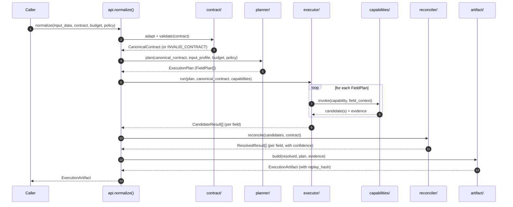

# Paxman Architecture

> **Status:** Draft v2 (post-documentation review)
> **Audience:** Engineers implementing or extending Paxman.
> **Related docs:** [PACKAGE_STRUCTURE.md](./package-structure.md), [GLOSSARY.md](./glossary.md), [docs/adr/](../adr/)

This document describes the **system architecture** of Paxman. It is implementation-agnostic at the level of "what subsystems exist" and "what their boundaries are," but it is concrete about **why** the boundaries are where they are. For module-level implementation rules, see [PACKAGE_STRUCTURE.md](./package-structure.md).

---

## 1. Architecture Overview

Paxman Core consists of **seven major subsystems**, plus the public `api/` surface. Each subsystem has strict, well-defined responsibilities. This separation preserves determinism, debuggability, and architectural clarity.

```text
                ┌─────────────────────┐
                │       api/          │   ← The only thing users see
                └──────────┬──────────┘
                           │
        ┌──────────────────┼──────────────────┐
        ▼                  ▼                  ▼
  ┌───────────┐      ┌───────────┐      ┌───────────────┐
  │ contract/ │      │ planner/  │      │ capabilities/ │
  │ adapters  │ ───▶ │ field plan│ ───▶ │ atomic ops    │
  │ validator │      │ synthesis │      │ (V1 surface)  │
  └───────────┘      └─────┬─────┘      └───────┬───────┘
                           │                    │
                           ▼                    ▼
                      ┌───────────┐        ┌───────────┐
                      │ executor/ │ ─────▶ │ reconciler│
                      │ runs plan │        │ / merge / │
                      └─────┬─────┘        │ confidence│
                            │              └─────┬─────┘
                            │                    │
                            └────────┬───────────┘
                                     ▼
                              ┌───────────┐
                              │ artifact/ │
                              │ final     │
                              │ bundle    │
                              └───────────┘
```

**Subsystem count clarification:** Paxman has **seven internal subsystems** (contract, planner, capabilities, executor, reconciler, artifact, api). Earlier drafts said "six" because the public flow diagram in §1 omitted `capabilities/` (treated as the Executor's toolset) and `api/` (treated as a presentation layer). This document treats all seven as first-class subsystems to match the actual package layout in [PACKAGE_STRUCTURE.md](./package-structure.md).

| # | Subsystem | One-line responsibility |
|---|---|---|
| 1 | `contract/` | Translate and validate caller contracts into the canonical internal form. |
| 2 | `planner/` | Build a deterministic, field-by-field execution plan. |
| 3 | `capabilities/` | Provide atomic, reusable operations. LLMs live behind inference providers. |
| 4 | `executor/` | Run the plan; collect evidence; stop early when satisfied. |
| 5 | `reconciler/` | Merge candidates, assign final confidence, resolve truth. |
| 6 | `artifact/` | Freeze the evidence-backed, replayable output. |
| 7 | `api/` | Expose the tiny public surface. |

---

## 2. High-Level Flow



**Step-by-step:**

1. Receive `input_data` and `target_contract`.
2. **Canonicalize** the contract via the `contract/` adapter subsystem.
3. **Validate** the contract via the `contract/` validator.
4. Analyze the input profile (lightweight classification; no capability invocation).
5. **Plan** a deterministic, field-centric execution plan.
6. **Execute** capabilities in plan order, collecting evidence and diagnostics.
7. **Reconcile** candidate truths: merge, detect conflicts, assign confidence, resolve.
8. **Build** the artifact: normalized data + evidence + diagnostics + replay data.
9. Return the artifact. Paxman does no further work.

---

## 3. Core Architectural Principles

### 3.1 Contract externalization

Paxman remains agnostic about where the contract came from. It only needs a canonical internal representation. Every adapter translates into and out of the same `CanonicalContract`.

### 3.2 Deterministic planning

Given the same input profile, canonical contract, configuration, and capability set, the planner must choose the same plan. The planner is a pure function over (canonical contract, input profile, configuration, capability registry). No LLM, no random, no clock.

### 3.3 Isolation of concerns

- **Contract** defines *what* output must look like.
- **Planner** defines *what to do*.
- **Executor** defines *how to run it*.
- **Reconciler** defines *what is ultimately true*.
- **Artifact** defines *what was produced*.
- **API** defines *what the user can ask for*.

Subsystem boundaries are enforced by lint rules and review. See [PACKAGE_STRUCTURE.md §8 System Boundary Rules](./package-structure.md) for the formal rules and how to enforce them.

### 3.4 Field-centric, not document-centric

Paxman plans resolution **independently for each required field**. There is no "parse the document" mega-step. This enables cost optimization, targeted inference, and selective capability invocation. See [ADR-0001](../adr/0001-field-centric-planning.md).

### 3.5 Capability confidence rule

Capabilities **never** assign confidence. They return candidates + evidence + diagnostics. Confidence is assigned **only** by the Reconciler; the Planner emits a `target_confidence` (read from the field's `confidence_threshold`) but never scores a candidate. This prevents confidence inflation. See [ADR-0005](../adr/0005-confidence-ownership.md).

### 3.6 The pipeline is synthesized, not fixed

Paxman does not have a single canonical pipeline. It synthesizes a plan per (contract, input) pair. Different inputs may use different capabilities for the same field. See [ADR-0002](../adr/0002-rule-based-planner-v1.md).

---

## 4. Subsystem Specification

### 4.1 `contract/` — Translation + Validation Boundary

The only layer that knows about external contract formats. Adapters produce a `CanonicalContract`; the validator rejects anything invalid with `INVALID_CONTRACT`.

**Inputs:** a caller-supplied contract (Pydantic model, JSON Schema, Dict DSL, or OpenAPI).
**Outputs:** a `CanonicalContract` (validated) **or** an `INVALID_CONTRACT` error with structured details.

Responsibilities:

- Structural conversion to the canonical form.
- Semantic annotation (e.g., "this string is an ISO-4217 currency code").
- Field normalization (paths, names, constraints).
- Constraint translation.
- Validation: types, constraints, paths, semantic tags, confidence thresholds.

**Supported V1 types:** `STRING`, `INTEGER`, `DECIMAL`, `BOOLEAN`, `DATE`, `ENUM`, `OBJECT`, `ARRAY`, `MONEY`. (See [GLOSSARY.md](./glossary.md) for definitions.)

**Why this is a hard boundary:** the planner, executor, reconciler, and artifact subsystems never see Pydantic, JSON Schema, or OpenAPI. This is what makes Paxman contract-format-agnostic. See [ADR-0004](../adr/0004-money-first-class-type.md) for the rationale on first-class types and [ADR-0007](../adr/0007-contract-adapter-set-v1.md) for the V1 adapter set.

### 4.2 `planner/` — Field-Centric Plan Synthesis

Deterministic, rule-based. Reads the canonical contract, analyzes the input profile, produces a `FieldPlan` per required field.

**Inputs:** `CanonicalContract`, `InputProfile`, `Budget`, `Policy`, `CapabilityRegistry`.
**Outputs:** `ExecutionPlan` = ordered list of `FieldPlan`s.

**Heuristic ordering** (highest to lowest preference):

1. Explicit evidence (already present in input)
2. Local deterministic extraction (regex, parser)
3. Structured lookup (deterministic table join)
4. Derived computation (formula over resolved fields)
5. Local inference (small local model)
6. Remote inference (LLM)
7. `UNRESOLVED` (terminal)

This ordering is a **default**; the planner can be overridden per contract via `ResolutionPolicy` on a field. See [ADR-0002](../adr/0002-rule-based-planner-v1.md).

**FieldPlan shape** (informal; see [PACKAGE_STRUCTURE.md §planner](./package-structure.md) for module-level details):

```python
FieldPlan(
    field_id: str,
    capability_chain: list[CapabilityInvocation],
    early_stop_threshold: float,  # confidence target
    fallback_policy: ResolutionPolicy,
)
```

### 4.3 `capabilities/` — Atomic Operations

Reusable, versioned, metadata-declared operations. The V1 surface is deliberately small.

**V1 capabilities:**

| Capability ID | Purpose | Deterministic? |
|---|---|---|
| `text_extraction` | Pull plain text from raw input (PDF, image, HTML) | No (provider-dependent) |
| `regex_extraction` | Pattern-based local extraction | Yes |
| `lookup` | Structured / retrieval-based extraction | Yes (deterministic backend) or No (vector backend) |
| `inference` | Model-backed extraction. LLMs are providers, not the capability. | No (model-dependent) |
| `validation` | Verify a candidate value against a constraint | Yes |

**Capability contract** (informal; see [PACKAGE_STRUCTURE.md §capabilities](./package-structure.md)):

```python
CapabilitySpec(
    id: str,
    version: str,
    input_type: type,
    output_type: type,
    cost_estimate: CostHint,        # tokens, ms, $
    deterministic: bool,
    requires: list[str],            # required provider classes
)

CapabilityResult(
    candidates: list[Candidate],
    evidence: list[EvidenceRef],
    diagnostics: list[Diagnostic],
)
```

**Critical rule:** capabilities never assign confidence. See [ADR-0005](../adr/0005-confidence-ownership.md).

### 4.4 `executor/` — Deterministic Runner

Runs the plan **exactly** as the Planner defined it. No replanning, no rerouting, no structural retries. Stops early when a field hits its confidence target.

**Inputs:** `ExecutionPlan`, `CanonicalContract`, `CapabilityRegistry`, `InputData`.
**Outputs:** `CandidateResult[]` — one per `FieldPlan`, with raw candidates and evidence.

Responsibilities:

- Walk `FieldPlan`s in order.
- Invoke each capability in the field's `capability_chain`.
- Pass context forward (e.g., "supplier_name was already resolved").
- Stop early when confidence target is reached.
- Return `UNRESOLVED` candidates when the chain is exhausted without meeting the threshold.

The Executor **never** assigns final confidence; it only collects candidate evidence.

### 4.5 `reconciler/` — Truth Resolution

First-class subsystem. The only place that assigns **final** confidence and **final** truth.

**Inputs:** `CandidateResult[]`, `CanonicalContract`.
**Outputs:** `ResolvedResult[]` — one per field, with final value, final confidence, and `evidence_refs[]`.

Three truth layers:

```text
Contract Truth (what the caller requires)
        ↓
Candidate Truth (what capabilities discovered)
        ↓
Resolved Truth (what the Reconciler accepts into the artifact)
```

Responsibilities:

- Merge candidate values (union, intersection, prefer-by-evidence).
- Detect conflicts between candidates.
- Compare evidence quality.
- Assign final confidence (float 0.0–1.0) and confidence band.
- Resolve final truth.
- Decide when a field is `UNRESOLVED` vs `PARTIAL_SUCCESS`.

The Reconciler **never** executes capabilities and **never** reads raw input.

### 4.6 `artifact/` — The Product

The final output bundle. The only replay source.

**Inputs:** `ResolvedResult[]`, `ExecutionPlan`, evidence, diagnostics, statistics, configuration.
**Outputs:** `ExecutionArtifact` (JSON-serializable).

Contains:

- `normalized_data` — the resolved output matching the contract shape.
- `field_results` — `FieldResult[]` with status, value, confidence, `evidence_refs`.
- `unresolved_fields` — explicit list of fields the engine could not resolve.
- `evidence` — provenance records (capability, source, span, model id, etc.).
- `diagnostics` — structured warnings and notes.
- `execution_plan` — the `FieldPlan[]` that was executed.
- `replay_hash` — deterministic signature over contract + plan + capability versions + configuration.
- `statistics` — token counts, capability invocations, latency, cost.

Statuses: `SUCCESS`, `PARTIAL_SUCCESS`, `UNRESOLVED`, `INVALID_CONTRACT`, `EXECUTION_FAILED`. See [GLOSSARY.md](./glossary.md) for definitions.

### 4.7 `api/` — Public Surface

The only thing users see. Tiny, stable, versioned.

```python
import paxman

result = paxman.normalize(
    input_data=...,
    contract=...,
    budget=...,
    policy=...,
)

rehydrated = paxman.replay(artifact, contract=...)
```

**Stability rules:**

- Public API is whatever is re-exported from `paxman/__init__.py`.
- Subsystem names, `FieldPlan`, `CapabilitySpec`, `TruthLayer` **do not** leak.
- CI enforces the public surface: a `test_public_api.py` fails if anything new is added without an ADR.

---

## 5. Internal Module Layout

```text
paxman_core/
├── contract/
│   ├── canonical.py
│   ├── validator.py
│   ├── semantics.py
│   └── adapters/
│       ├── pydantic.py
│       ├── json_schema.py
│       ├── dict_dsl.py
│       └── openapi.py
│
├── planner/
│   ├── planner.py
│   ├── heuristics.py
│   ├── scoring.py
│   ├── policies.py
│   └── field_plan.py
│
├── capabilities/
│
├── executor/
│
├── reconciler/
│
├── artifact/
│
└── api/
```

For module-level details, see [PACKAGE_STRUCTURE.md](./package-structure.md).

---

## 6. Error Model

### 6.1 Status codes (artifact-level)

| Status | Meaning | Caller action |
|---|---|---|
| `SUCCESS` | All required fields resolved with acceptable confidence | Consume `normalized_data` |
| `PARTIAL_SUCCESS` | Some required fields resolved; some `UNRESOLVED` | Inspect `unresolved_fields`; decide whether to retry or accept |
| `UNRESOLVED` | No required field reached the confidence threshold | Reject or retry with a stronger budget |
| `INVALID_CONTRACT` | The contract failed validation | Fix the contract; do not retry |
| `EXECUTION_FAILED` | An unrecoverable error occurred during execution | Inspect `diagnostics`; do not blindly retry |

### 6.2 Error hierarchy (Python exceptions)

```python
PaxmanError (base)
├── InvalidContractError
│     ├── UnsupportedFieldTypeError
│     ├── InvalidConstraintError
│     ├── InvalidPathError
│     └── InvalidSemanticTagError
├── ExecutionError
│     ├── CapabilityError
│     │     └── InferenceProviderError
│     ├── BudgetExceededError
│     └── ReconciliationError
├── ReplayError
│     ├── VersionMismatchError
│     └── HashMismatchError
└── ConfigurationError
      ├── InvalidBudgetError
      └── InvalidPolicyError
```

Each exception carries an `error_code` (string from §6.1) and a structured `context` dict for logging and tracing. This mirrors the Pydantic / instructor pattern of a `type` code + `loc` + `msg` + `ctx`.

### 6.3 Status vs exception: when to use which

- **Exception** — the failure is unrecoverable and the caller must handle it. Examples: `INVALID_CONTRACT`, `EXECUTION_FAILED` for capability crashes.
- **Status** — the failure is "expected" (e.g., a field cannot be resolved) and is encoded into the artifact. Examples: `UNRESOLVED`, `PARTIAL_SUCCESS`.

A `BudgetExceededError` is an exception because the caller violated a contract constraint. An `UNRESOLVED` field is a status because it is the engine's honest report of what it could and could not do.

---

## 7. Configuration Model

Paxman takes three explicit configuration objects at the call site:

```python
result = paxman.normalize(
    input_data=...,
    contract=...,
    budget=Budget(
        max_total_cost_usd=Decimal("0.10"),  # Decimal per ADR-0004 / ADR-0010
        max_total_latency_ms=5_000,
        max_remote_inference_calls=2,
    ),
    policy=Policy(
        allow_remote_inference=True,
        allow_local_inference=True,
        confidence_floor=0.80,
        unresolved_acceptable=False,
    ),
)
```

### 7.1 `Budget` (hard limits)

| Field | Type | Meaning |
|---|---|---|
| `max_total_cost_usd` | `Decimal \| None` | Hard cap on cost in USD; aborts the run when exceeded. Constructor accepts `float \| int \| Decimal` and coerces to `Decimal` (MONEY is Decimal per ADR-0004 / ADR-0010). |
| `max_total_latency_ms` | `int \| None` | Hard cap on wall-clock latency. |
| `max_remote_inference_calls` | `int \| None` | Cap on remote inference invocations. |
| `max_capability_invocations` | `int \| None` | Cap on total capability invocations. |

When any budget is exceeded, the artifact is returned with status `PARTIAL_SUCCESS` and a `BudgetExceededError` is logged in diagnostics. (V1: the behavior on budget exceeded is configurable; default is to short-circuit and return what was resolved.)

### 7.2 `Policy` (soft preferences)

| Field | Type | Meaning |
|---|---|---|
| `allow_remote_inference` | `bool` | If `False`, the planner excludes step 6 of the heuristic. |
| `allow_local_inference` | `bool` | If `False`, the planner excludes step 5. |
| `confidence_floor` | `float` | Minimum confidence to mark a field `SUCCESS`; below this is `PARTIAL_SUCCESS`. |
| `unresolved_acceptable` | `bool` | If `False`, the artifact status is `UNRESOLVED` when any required field is unresolved. |
| `currency_policy` | `CurrencyPolicy \| None` | For `MONEY` fields: behavior on cross-currency arithmetic. |

### 7.3 `ContractPolicy` (per-contract)

Set on the `CanonicalContract` itself; overrides call-site `Policy` for that contract. Example use: "this contract's `tax_amount` field may never be inferred; it must be explicit or `UNRESOLVED`."

---

## 8. Truth Resolution Model

Paxman operates on three explicit truth layers:

```text
Contract Truth (what the caller requires — frozen at validation)
        ↓
Candidate Truth (what capabilities discover — mutable, may be empty)
        ↓
Resolved Truth (what the Reconciler accepts into the artifact — frozen at emission)
```

**Key invariants:**

- The Reconciler is the **only** subsystem that mutates Candidate Truth into Resolved Truth.
- The Planner reads Contract Truth to plan and the Reconciler reads Contract Truth to validate; the Planner does not write Resolved Truth.
- Confidence is assigned **only** in the Reconciler. The Planner may emit a `target_confidence` (the field's `confidence_threshold`) but never assigns confidence to a candidate. See [ADR-0005](../adr/0005-confidence-ownership.md).

---

## 9. Versioning Strategy

Paxman has four versioned dimensions:

| Dimension | Format | Source of truth | Bump triggers |
|---|---|---|---|
| **Library version** | `MAJOR.MINOR.PATCH` (semver) | `pyproject.toml` | API breakage, deprecation, new features |
| **Planner version** | Embedded in artifact | Internal constant | Algorithm change that affects the plan |
| **Capability version** | `<capability_id>@<semver>` | Capability registry | Capability input/output/cost change |
| **Contract schema version** | `<adapter>:<version>` (e.g., `pydantic:2`, `json_schema:draft-2020-12`) | Adapter | Source format change |

### 9.1 Library version policy (semver)

- **MAJOR** (1.0 → 2.0) — breaking change to public API, artifact format, or replay semantics.
- **MINOR** (1.0 → 1.1) — new feature, new optional dependency, new capability, **backward compatible**.
- **PATCH** (1.0.0 → 1.0.1) — bug fix, perf, doc, **no public API change**.

### 9.2 What is and is not a breaking change

Following Pydantic's published policy as a model:

**NOT a breaking change** in MINOR:

- Adding new error codes.
- Adding new fields to error responses.
- Changing error message text (use `error_code` for programmatic handling).
- Adding a new optional configuration parameter.
- Adding a new optional capability.
- Adding a new optional adapter.

**IS a breaking change** in MAJOR:

- Removing a public API method.
- Changing a public method signature.
- Removing an error code.
- Changing the artifact JSON shape for a field that is already emitted.
- Changing replay semantics such that the same artifact + version no longer reproduces.

### 9.3 Pre-1.0

Before 1.0, MINOR versions may contain breaking changes. The current target is **1.0** when:

- All 9 success metrics in PRD §9 are met or explicitly waived.
- All 8 V1 acceptance criteria in PRD §10 are met.

### 9.4 Capability versioning

Capabilities are independently versioned. A capability is referenced in `FieldPlan` as `<id>@<version>`. The planner may pin a major version. Replay checks the pinned versions.

### 9.5 Replay compatibility matrix

A new Paxman version can replay an old artifact **only if** the artifact's planner version and capability versions are supported by the new Paxman. Mismatches raise `VersionMismatchError` (replay) or `HashMismatchError` (rehydration). See [REPLAY_AND_DETERMINISM.md](./replay-and-determinism.md) for the full replay model.

---

## 10. Testing Architecture

See [TESTING_STRATEGY.md](../contributing/testing-strategy.md) for the full strategy. This section lists the architectural seams.

### 10.1 Test seams

| Subsystem | Seam | How to test in isolation |
|---|---|---|
| `contract/` | Adapter + Validator as pure functions | Inject fixture contracts; assert `CanonicalContract` |
| `planner/` | `plan(canonical, input_profile, budget, policy, registry) → ExecutionPlan` | Inject a fake `CapabilityRegistry` |
| `capabilities/` | Each capability as a `Protocol` | Mock the provider; assert `CapabilityResult` |
| `executor/` | `run(plan, contract, registry, input) → CandidateResult[]` | Mock all capabilities; assert invocation order |
| `reconciler/` | `reconcile(candidates, contract) → ResolvedResult[]` | Feed crafted candidates; assert final truth |
| `artifact/` | `build(resolved, plan, evidence) → ExecutionArtifact` | Build from fixtures; assert replay_hash determinism |

### 10.2 Determinism tests

For every subsystem, two tests:

1. **Property test** — given the same inputs, the same outputs (Hypothesis).
2. **Replay test** — given a fixture artifact, rehydrate produces the same JSON hash.

### 10.3 End-to-end fixtures

A curated set of `(input, contract, expected_artifact)` fixtures that exercise every capability and adapter. The fixtures are checked into the repo and used in CI.

### 10.4 Coverage

- ≥ 90% line coverage on `contract/`, `planner/`, `executor/`, `reconciler/`.
- 100% coverage on `errors.py` and `versioning.py`.

---

## 11. Concurrency Model

### 11.1 V1

- `paxman.normalize()` is **synchronous and not thread-safe** within a single process. Callers must serialize calls.
- The Executor runs field plans **sequentially** in a deterministic order. No parallel field execution.
- Capabilities may be thread-safe internally (their choice); Paxman does not require it.

### 11.2 Future (V2)

- Parallel field execution is permitted **only if** the planner proves that the fields are independent (no derived computation dependencies).
- A `Policy.parallelism` knob would let callers opt in.
- Async API (`async def normalize`) is V2.

This decision is to keep V1 deterministic and replayable end-to-end without a complex scheduler. See [ADR-0006](../adr/0006-sequential-execution-v1.md).

---

## 12. Observability

### 12.1 What Paxman emits

- **Structured events** — at the start of planning, per capability invocation, per field resolution, and at artifact emission.
- **Diagnostics** — encoded into the artifact (e.g., "skipped remote inference because `policy.allow_remote_inference=False`").
- **Counters** — capability invocations, tokens, cost, latency per call.

### 12.2 What Paxman does NOT emit

- **Raw input** is never written to logs or telemetry by default.
- **Inference prompts and completions** are not emitted by default; they are recorded in `evidence` only when the caller opts in.

### 12.3 Determinism-safe logging

- Logs are emitted via `structlog` (or an injected logger) with **no timestamps** in the replay path.
- Clock reads are injected; in tests, a fixed clock is used.
- Random number generators are injected; the planner does not use them.

This allows the same execution to produce the same artifact and the same logs.

### 12.4 Metrics (non-replay path)

For non-replay consumers (production monitoring), Paxman emits:

- `paxman_normalize_total{status=...}` — counter
- `paxman_normalize_duration_seconds` — histogram
- `paxman_capability_invocations_total{capability=...,version=...}` — counter
- `paxman_replay_total{status=...}` — counter

Metric emission is opt-in via `Policy.emit_metrics: bool` (default `False`).

---

## 13. Security and PII Model

See [SECURITY.md](../security/index.md) for the full threat model. This section is the architectural summary.

### 13.1 Data handling defaults

| Data type | Default behavior | Override |
|---|---|---|
| Raw input | Held in memory only; never written to logs or artifacts | `Policy.log_raw_input: bool` (default `False`) |
| Inference prompts | Held in memory only; not in artifacts | `Policy.record_inference_io: bool` (default `False`) |
| Inference completions | Same as prompts | Same |
| PII | Caller's responsibility to redact or sanitize | No Paxman auto-redaction in V1 |
| Provider secrets | Passed by reference (env var name or secret store handle) | Never embedded in artifacts |
| Evidence | Stored as references (span offsets, capability id, source identifier) | `Policy.embed_evidence_payload: bool` (default `False`) |

### 13.2 Prompt-injection posture

The Inference capability accepts arbitrary completion text. The Reconciler treats inference output as **untrusted** until validated by the Validation capability or a downstream `ValidationPolicy`. No inference output is ever trusted as a final value without validation. This is enforced at the Reconciler, not the capability.

### 13.3 Multi-tenant posture

Paxman is a library. It does not enforce tenant isolation. The caller (e.g., a SaaS wrapper) is responsible for routing inputs and artifacts to the right tenant store.

---

## 14. Performance and SLOs

Paxman does not commit to formal SLOs in V1. The following are **aspirational targets** for measurement only:

| Operation | Target p50 | Target p99 | Notes |
|---|---|---|---|
| `paxman.normalize()` — 20-field contract, 100 KB input, no remote inference | ≤ 200 ms | ≤ 2 s | Cold process |
| `paxman.replay()` — 100 KB artifact | ≤ 50 ms | ≤ 500 ms | Rehydration only |
| Cold import + capability registration | ≤ 100 ms | ≤ 500 ms | At interpreter start |
| `CanonicalContract` construction (Pydantic adapter) | ≤ 50 ms | ≤ 500 ms | For a 50-field model |

### 14.1 Profiling hooks

V1 ships:

- A `Profile` event hook that records per-capability latency.
- A `BudgetTracker` that records per-capability cost.
- A `Clock` injection point for deterministic tests.

### 14.2 What is NOT a perf guarantee

- Inference latency (provider-dependent).
- Network round-trips.
- Adapter time for very large contracts (>10,000 fields).

---

## 15. Extension Model

See [EXTENDING.md](./extending.md) for the step-by-step guide. This section is the architectural summary.

### 15.1 Adding a new contract adapter

1. Implement `ContractAdapter` protocol: `def adapt(self, external_contract) -> CanonicalContract` and `def export(self, canonical) -> ExternalFormat`.
2. Register with `CapabilityRegistry` (or `ContractAdapterRegistry`).
3. Add a V1 contract adapter set entry.

### 15.2 Adding a new capability

1. Implement `Capability` protocol: `def invoke(self, ctx) -> CapabilityResult` and `def spec(self) -> CapabilitySpec`.
2. Register with the global `CapabilityRegistry`.
3. Add to the planner's heuristic ordering (or define a new strategy) via ADR.

### 15.3 Adding a new inference provider

1. Implement `InferenceProvider` protocol: `def complete(self, prompt, model) -> Completion`.
2. Register as the provider for the `inference` capability.
3. The provider is **not** a capability — capabilities remain provider-agnostic.

### 15.4 Adding a new policy or budget field

This is a public API change and requires a new ADR and a MINOR (or MAJOR, if breaking) version bump.

---

## 16. Migration and Upgrade Story

### 16.1 Replay across Paxman versions

- An artifact recorded under Paxman 1.0 is replayable on Paxman 1.1.x (within the same major).
- A Paxman 1.x artifact replayed on Paxman 2.0 raises `VersionMismatchError` with a clear message; the caller must regenerate the artifact.
- The replay-hash includes the planner version; the executor checks the planner version before rehydrating.

### 16.2 Capability upgrades

- A capability at `<id>@1.0` is replaced by `<id>@1.1` only on explicit registration. Old plans still pin the old version.
- Old plans replay using the old capability version; if the old version is no longer registered, replay raises `CapabilityNotFoundError`.

### 16.3 Contract adapter upgrades

- A contract adapter can be upgraded independently. Adapters are responsible for forward-compatibility within a major.

### 16.4 Deprecation policy

- Public API: deprecate in MINOR, remove in next MAJOR.
- Internal API: no deprecation cycle; rename freely between MAJORs.
- ADRs document every deprecation and removal.

---

## 17. V1 Scope

### 17.1 What to ship in V1

- Contract Adapters: Pydantic, JSON Schema, Dict DSL (required); OpenAPI (optional, best-effort).
- Contract Validator.
- Canonical Contract Model.
- Field-Centric Planner (rule-based).
- Executor (sequential).
- Reconciler.
- Artifact Builder.
- 5 Capabilities: `text_extraction`, `regex_extraction`, `lookup`, `inference`, `validation`.
- Replay hash + replay rehydration.
- 1 reference inference provider (stub or local).

### 17.2 What to postpone to V2

- Capability marketplace.
- Visual planners.
- Graph execution.
- LLM planners.
- Workflow orchestration.
- Persistent execution.
- RAG subsystems.
- Multi-agent coordination.
- Parallel field execution.
- Async API.
- Distributed tracing export.

---

## 18. Data Flow Diagram

```text
       Caller
         │
         │  input_data + contract + budget + policy
         ▼
   ┌─────────────┐
   │ api.normalize│
   └──────┬──────┘
          │
          ▼
   ┌──────────────────┐
   │ contract.adapt   │ ──▶ INVALID_CONTRACT (exception)
   │ contract.validate│
   └──────┬───────────┘
          │  CanonicalContract
          ▼
   ┌──────────────────┐
   │ input.profile    │ (lightweight classification)
   └──────┬───────────┘
          │  InputProfile
          ▼
   ┌──────────────────┐
   │ planner.plan     │
   └──────┬───────────┘
          │  ExecutionPlan (FieldPlan[])
          ▼
   ┌──────────────────┐
   │ executor.run     │
   │  ├── capability₁ │
   │  ├── capability₂ │ ──▶ candidates + evidence
   │  └── ...         │
   └──────┬───────────┘
          │  CandidateResult[]
          ▼
   ┌──────────────────┐
   │ reconciler.recon │
   │  merge, conflict,│ ──▶ resolved truth + confidence
   │  confidence      │
   └──────┬───────────┘
          │  ResolvedResult[]
          ▼
   ┌──────────────────┐
   │ artifact.build   │
   │  serialize, hash │
   └──────┬───────────┘
          │  ExecutionArtifact (with replay_hash)
          ▼
        Caller
```

---

## 19. Open Architectural Questions

These are tracked in PRD §13 as open questions for the V1 cycle. Architectural-level questions:

1. **Q-A1** Should the Planner emit a `target_confidence` for each `FieldPlan` (yes, per §4.2) or only on the contract field? *(Resolved: per-field on the contract; the planner reads it.)*
2. **Q-A2** Is a `ResolutionPolicy` per field or per contract? *(Resolved: per field; the contract carries a default.)*
3. **Q-A3** Should `MONEY` arithmetic be a capability or a Reconciler primitive? *(Open — likely a Reconciler primitive; see [ADR-0004](../adr/0004-money-first-class-type.md).)*
4. **Q-A4** How are conflicting `UNRESOLVED` reasons represented? *(Open — design candidate: list of `(capability_id, reason_code, message)`.)*
5. **Q-A5** Does the Executor support capability-level cancellation? *(Open — V1: no; cancel = abort the run.)*

---

## 20. References

- [PACKAGE_STRUCTURE.md](./package-structure.md) — Module layout, dependency DAG, public/private split.
- [GLOSSARY.md](./glossary.md) — Full domain vocabulary.
- [REPLAY_AND_DETERMINISM.md](./replay-and-determinism.md) — Replay model deep dive.
- [SECURITY.md](../security/index.md) — Threat model and PII handling.
- [TESTING_STRATEGY.md](../contributing/testing-strategy.md) — Test seams and determinism tests.
- [DEVELOPMENT.md](../contributing/development.md) — Local dev setup.
- [EXTENDING.md](./extending.md) — How to add a capability, adapter, or provider.
- [DEPENDENCIES.md](./dependencies.md) — Core vs optional dependencies.
- [docs/adr/](../adr/) — Architecture Decision Records.
